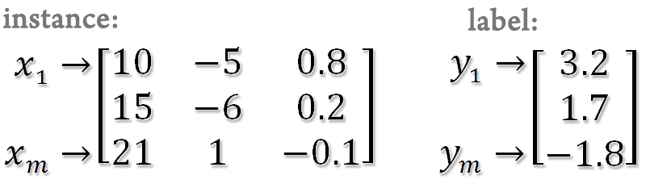

# Smooth Support Vector Machine Toolbox

## Introduction
SSVM toolbox is an implementation of Smooth Support Vector Machine in Matlab. SSVM is a reformulation of conventional SVM and can be solved by a fast Newton-Armijo algorithm. Besides, choosing a good parameter setting for a better performance in a learning task is an important issue. We also provide an automatic model selection tool to help users to get a good parameter setting. SSVM toolbox now includes [smooth support vector machine](paper/ssvm.pdf) for classification, [epsilon-insensitive smooth support vector regression](paper/SSVR_TKDE.pdf) and an automatic [model selection tool using uniform design](paper/UD4SVM013006.pdf).

## Key Features
* Solve classification ([SSVM](src/SSVM_M.m)) and regression ([SSVR](src/SSVR_M.m)) problems
* Support linear, polynomial and radial basis kernels
* Provide an automatic model selection for SSVM and SSVR with RBF kernels
* Can handle large scale problems by using reduced kernel (RSVM)
* Provide cross validation evaluation
* Provide an alternative initial point other than zero using regularized least squares

## Download SSVM Toolbox
* [Matlab implementation](src/SSVMtoolbox/matlab)
* [Python implementation](src/SSVMtoolbox/python)
* [R implementation](src/SSVMtoolbox/r)

## Data Format
SSVM toolbox is implemented in Matlab. Use a data format which can be loaded into Matlab. The instances are represented by a matrix (rows for instances and columns for variables) and the labels (1 or -1) or responses are represented by a column vector.  

For classification  
<p align="center">
  
</p>

For regression
<p align="center">
  
</p>

Here are some sample datasets.

## Code Usage
SSVM toolbox contains three main functions： ssvm_train for SVMs training, ssvm_predict for SVMs prediction and hibiscus for automatic model selection.

### Usage of ssvm_train

`model = ssvm_train(label, inst, 'options')`

#### Input of ssvm_train:
Variable | Description 
---- | ----
label | training data class label or response
inst | training data inputs

#### Options:
Variable | Description
---- | ----
-s | learning algorithm (default: 0)<br/> 0-SSVM<br/> 1-SSVR
-t | kernel type (default: 2)<br/> 0-linear <br/> 1-polynomial <br/> 2-radial basis (Gaussian kernel)
-c | the weight parameter C of SVMs (default: 100)
-e | epsilon-insensitive value in epsilon-SVR (default: 0.1)
-g | gamma in kernel function (default: 0.1)
-d | degree of polynomial kernel function (default: 2)
-b | constant term of polynomial kernel function (default: 0)
-m | scalar factor of polynomial kernel function (default: 1)
-r | ratio of random subset size to the full data size (default: 1)
-i | alternatives initial point (default: 0) <br/> 0-using zero vector (w = 0, b = 0)<br/> 1-using an initial point obtained from regularized least squares
-v | number of cross-validation folds (default: 0)

#### Output of ssvm_train:
Variable | Description
---- | ----
model | learning model (a structure in Matlab)
.w | normal vector of separating (or response) hyperplane
.b | bias term
.RS | reduced set
.Err | error rate (a structure in Matlab)
.Training | training error
.Validation | validation error
.Final | final model error <br/> in classification, it returns the error rate <br/> in regression, it returns the relative 2-norm error and the mean absolute error
.params | parameters specified by the user inputs

 #### Example:
 * Classification using a Gaussian kernel  
 `model = ssvm_train(label, inst, 'options')`
 * Classification using a polynomial kernel and an initial point by regularized least squares  
 `model_two = ssvm_train(label, inst, '-s 0 -t 1 -c 23.71 -d 2 -m 3 -b 2 -i 1')`
 * SClassification using a Gaussian kernel and a 10% reduced set  
 `model_three = ssvm_train(label, inst, '-s 0 -t 2 -c 421 -g 0.31 -r 0.1')`
 * Classification using a Gaussian kernel in a 5-fold cross validation  
 `model_four = ssvm_train(label, inst, '-s 0 -t 2 -c 23.71 -g 0.0625 -v 5')`
 * Regression using the Gaussian kernel  
 `model_five = ssvm_train(label, inst, '-s 1 -t 2 -c 10000 -g 0.71')`

### Usage of ssvm_predict 
`[PredictedLabel, ErrRate ]= ssvm_predict(label, inst, model)`

#### Input of ssvm_predict:
Variable | Description 
---- | ----
label | testing data class label or response
inst | testing data inputs
model | model learned from ssvm_train or user-specified

#### Output of ssvm_predict:
Variable | Description 
---- | ----
Predicted | Labelpredicted label or response
ErrRate | error rate (for classification) or relative 2-norm error (for regression)

#### Example:
* prediction using model_one (classification problem)  
`[PredictedLabel, ErrRate]=ssvm_predict(label, inst, model_one)`  (Note: In this case, the error rate is meaningless.)
* prediction using model_one without testing labels(classification problem)  
`[PredictedLabel, ErrRate]=ssvm_predict(zeros(NumOfInstm,1), inst, model_one)`
* prediction using model_five (regression problem)  
`[PredictedLabel, ErrRate]=ssvm_predict(label, inst, model_five)`

### Usage of hibiscus
`Result = hibiscus(label, inst, 'method', 'type', 'command')`  

Note：only for Gaussian kernel

#### Input of hibiscus:
Variable | Description 
---- | ----
label | training data class label or response
inst | training data inputs
method | learning algorithm (default: 'SSVM') <br/> It must be {'SSVM', 'SSVR'} (case insensitive)
type | model selection methods (default: 'UD') <br/> It must be {'UD', 'GRID'} (case insensitive)
command | (optional) <br/> -v: number of cross-validation folds (default: 5)<br/> -r: ratio of random subset size to full data size (default: 1)

#### Output of hibiscus:
Variable | Description 
---- | ----
Result | Include all returned information (a structure in Matlab)
.TErr | Training Error
.VErr | Validation Error
.Best_C | The best C in our model selection method
.Best_Gamma | The best gamma in our model selection method
.Elapse | CPU time in seconds
.Points | Trying points
.Ratio | Ratio of random subset size to full data size

#### Example:
* Determine C and Gamma by a 5-fold cross-validation and the full kernel for classification  
`Result = hibiscus(label, inst, 'SSVM', 'UD', '-v 5 -r 1')`
* Determine C and Gamma by a 10-fold cross-validation and a 10% reduced kernel for classification  
`Result = hibiscus(label, inst, 'SSVM', 'UD', '-v 10 -r 0.1')`
* Determine C and Gamma by a 10-fold cross-validation and 10% reduced kernel for regression  
`Result = hibiscus(label, inst, 'SSVR', 'UD', '-v 10 -r 0.1')`

### Training and Testing Procedure

#### Classification procedure

1. Change your current directory to SSVMtoolbox folder
2. Load dataset from Ionosphere_dataset.mat (can be found in SSVMtoolbox)  
  ```
  load Ionosphere_dataset.mat
  ```
3. Determine good C and gamma via a 5-fold cross validation using full kernel  
  ```
  Result = hibiscus(label, inst, 'SSVM', 'UD', '-v 5 -r 1');
  ```
4. Read the contents of Result (Best_C, Best_Gamma, ...etc)  
  ```
  Result  
  Result.Best_C
  ```
5. Training a model by using Best_C and Best_Gamma in Result
  ```
  model = ssvm_train(label, inst, '-s 0 -t 2 -c 10 -g 0.0856');
  ```
6. Read the contents of model (w, b, parameters, ...etc)
  ```
  model
  model.w
  ```
7. Prediction using the model obtained from the training process (here, we use the training set as the testing set)
  ```
  [PredictedLabel, ErrRate]=ssvm_predict(label, inst, model);
  ```

#### Regression procedure
1. Change your current directory to SSVMtoolbox folder
2. Load dataset from housing_dataset.txt (can be found in SSVMtoolbox)
  ```
  load housing_dataset.txt
  ```
3. Split the housing data into inst and label
  ```
  inst = housing_dataset(:,1:13);
  label = housing_dataset(:,14);
  ```
4. Determine good C and gamma via a 5-fold cross validation and 10% reduced kernel
  ```
  Result = hibiscus(label, inst, 'SSVR', 'UD', '-v 5 -r 0.1');
  ```
5. Read the contents of Result (Best_C, Best_Gamma, ...etc)
  ```
  Result
  Result.Best_C
  ```

6. Training a model by using Best_C and Best_Gamma in Result
  ```
  model=ssvm_train(label, inst, '-s 1 -c 1000000 -g 0.1794 -r 0.1');
  ```

7. Read the contents of model (w, b, parameters, ...etc)
  ```
  model
  model.w
  ```

8. Prediction using the model obtained from the training process (here, we use the training set as the testing set)
  ```
  [PredictedLabel, ErrRate]=ssvm_predict(label, inst, model);
  ```

9. Read the value of relative 2-norm error and mean absolute error
  ```
  ErrRate(1)
  ErrRate(2)
  ```

## License
This software is available for non-commercial use only. The authors are not responsible for implications from the use of this software.
